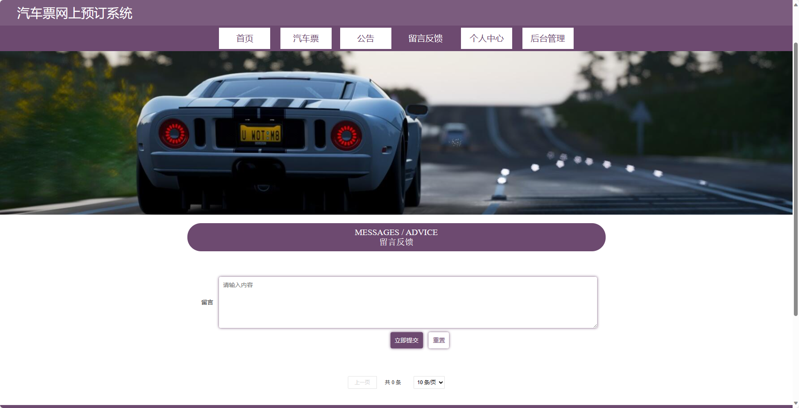
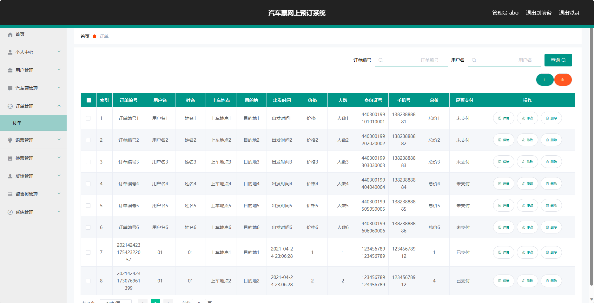

基于SpringBoot的汽车票网上预订系统（程序+论文）
=
- 完整代码获取地址：从戎源码网 ([https://armycodes.com/](https://armycodes.com/))
- 作者微信：19941326836  QQ：952045282 
- 承接计算机毕业设计、Java毕业设计、Python毕业设计、深度学习、机器学习
- 选题+开题报告+任务书+程序定制+安装调试+论文+答辩ppt 一条龙服务

一、项目介绍
---
基于Spring Boot框架实现的汽车票网上预订系统，系统包含两种角色：管理员、用户,系统分为前台和后台两大模块，主要功能如下。
### 【前台】：
1. 首页：展示网站信息、活动公告等。
2. 汽车票：提供汽车票查询、购买、修改订单、退票、换票等功能。
3. 公告：展示网站的新闻资讯、活动公告等。
4. 留言反馈：用户可以留言反馈意见和建议。
5. 个人中心：用户登录后可以查看个人信息、订单记录等。

### 【后台】：
### 【管理员】
1. 用户管理：管理员可以管理网站上的用户信息，包括添加、编辑、删除等操作。
2. 汽车票管理：管理员可以管理网站上的汽车票信息，包括添加、编辑、删除等操作。
3. 订单管理：管理员可以管理网站上的订单信息，包括查看、修改、取消等操作。
4. 退票管理：管理员可以管理网站上的退票申请，包括审核、处理等操作。
5. 换票管理：管理员可以管理网站上的换票申请，包括审核、处理等操作。
6. 反馈管理：管理员可以查看网站上的用户反馈信息，并进行回复等操作。
7. 留言板管理：管理员可以管理网站上的留言板信息，包括查看、删除等操作。
8. 系统管理：管理员可以管理系统的基本配置和权限设置等。
### 【用户】

1. 汽车票管理：用户可以查看、购买、修改、退票、换票等自己的汽车票订单信息。
2. 订单管理：用户可以查看自己的订单信息，包括历史订单和当前订单，进行修改、取消、支付等操作。
3. 个人信息：用户可以修改自己的个人信息，包括联系方式、密码等。
4. 反馈管理：用户可以查看自己提交的反馈信息的回复状态。

二、项目技术
---
- 编程语言：Java
- 数据库：MySQL
- 项目管理工具：Maven
- 前端技术：VUE、HTML、Jquery、Bootstrap
- 后端技术：Spring、SpringMVC、MyBatis

三、运行环境
---
- 操作系统：Windows、macOS都可以
- JDK版本：JDK1.8以上都可以
- 开发工具：IDEA、Ecplise、Myecplise都可以
- 数据库: MySQL5.7以上都可以
- Tomcat：任意版本都可以
- Maven：任意版本都可以

四、运行截图
---
### 论文截图：

### 程序截图：

